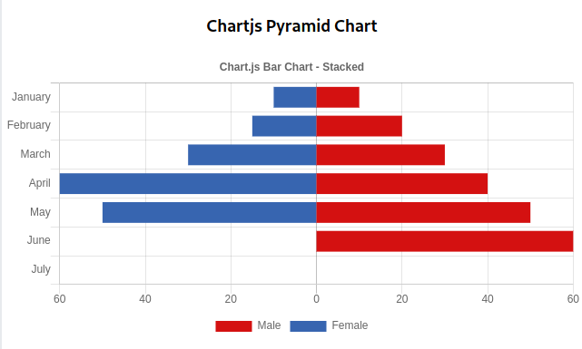

#### `Chart.JS` Pyramid Chart (Stacked Axis Chart) Example. 

`Chartjs` | `React` | `Javascript`



For documentation of chart.js check [here](https://www.chartjs.org)

To learn about what the code in there does, Check out this medium article and give some claps :bow: :+1:

https://medium.com/wesionary-team/pyramid-chart-with-chart-js-and-react-16a1916d5221


**TL;DR:** Use negative values for one data point and then customize tool tips and x-axis ticks to show positive numbers although they are negative numbers.

#### DATASET
```js
const barChartData: Chart.ChartData = {
  labels: ["January", "February", "March", "April", "May", "June", "July"],
  datasets: [
    {
      label: "Male",
      stack: "Stack 0",
      backgroundColor: "#d41111",
      data: [10, 20, 30, 40, 50, 60],
    },
    {
      label: "Female",
      stack: "Stack 0",
      backgroundColor: "#3765b0",
      data: [10, 15, 30, 60, 50].map((k) => -k),
    },
  ],
};

```

#### `Chart.JS` CONFIGURATION
```js
new Chart(ctx, {
        type: "horizontalBar",
        data: barChartData,
        options: {
          title: {
            display: true,
            text: "Chart.js Bar Chart - Stacked",
          },
          tooltips: {
            intersect: false,
            callbacks: {
              label: (c) => {
                const value = Number(c.value);
                const positiveOnly = value < 0 ? -value : value;
                let retStr = "";
                if (c.datasetIndex === 0) {
                  retStr += `Male: ${positiveOnly.toString()}`;
                } else {
                  retStr += `Female: ${positiveOnly.toString()}`;
                }
                return retStr;
              },
            },
          },
          responsive: true,
          legend: {
            position: "bottom",
          },
          scales: {
            xAxes: [
              {
                stacked: false,
                ticks: {
                  beginAtZero: true,
                  callback: (v) => {
                    return v < 0 ? -v : v;
                  },
                },
              },
            ],
            yAxes: [
              {
                stacked: true,
                ticks: {
                  beginAtZero: true,
                },
                position: "left",
              }
            ],
          },
        },
      });
```